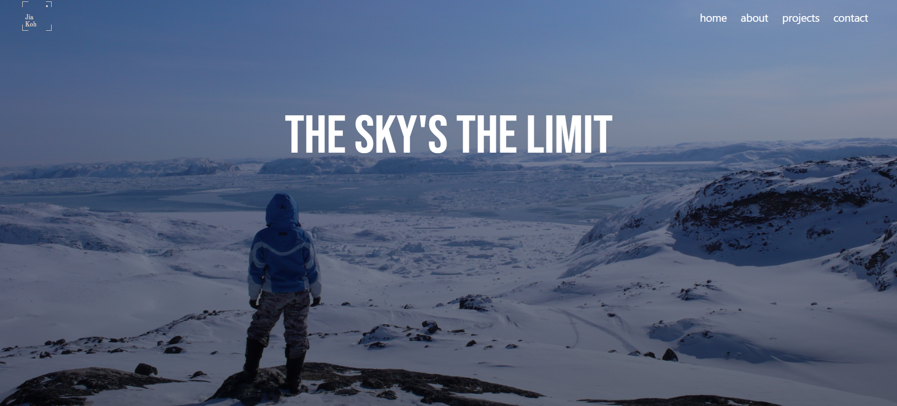

# Personal Portfolio 👩🏻‍💻
> This is my portfolio (version 3) showcasing my frontend development skills.  
> Live demo [_here_](https://jiakjiak.netlify.app/).

## Table of Contents 🧾
* [General Info ](#general-information)
* [Technologies Used](#technologies-used)
* [Features](#features)
* [Screenshots](#screenshots)
* [Project Status](#project-status)
* [Room for Improvement](#room-for-improvement)
* [Acknowledgements](#acknowledgements)
* [Contact](#contact)

## General Information
- The goal of this project is to demonstrate new skills I've acquired through self-learning and improve my portfolio.

## Technologies Used
- HTML
- CSS
- Bootstrap
- jQuery (JavaScript)

## Features
- Project highlights
- Contact form

## Screenshot

## Project Status
Project is: _in progress_ 

## Room for Improvement
- Add more interactive elements to the background
- Spice up menu bar items
- Improve the layout

**To do:**
- Adding more projects
- Adding code comments

## Acknowledgements
- This README.md was inspired by [ritaly](https://github.com/ritaly)

## Contact
[jiakjiak](https://jiakjiak.netlify.app/#contact) - feel free to contact me!
